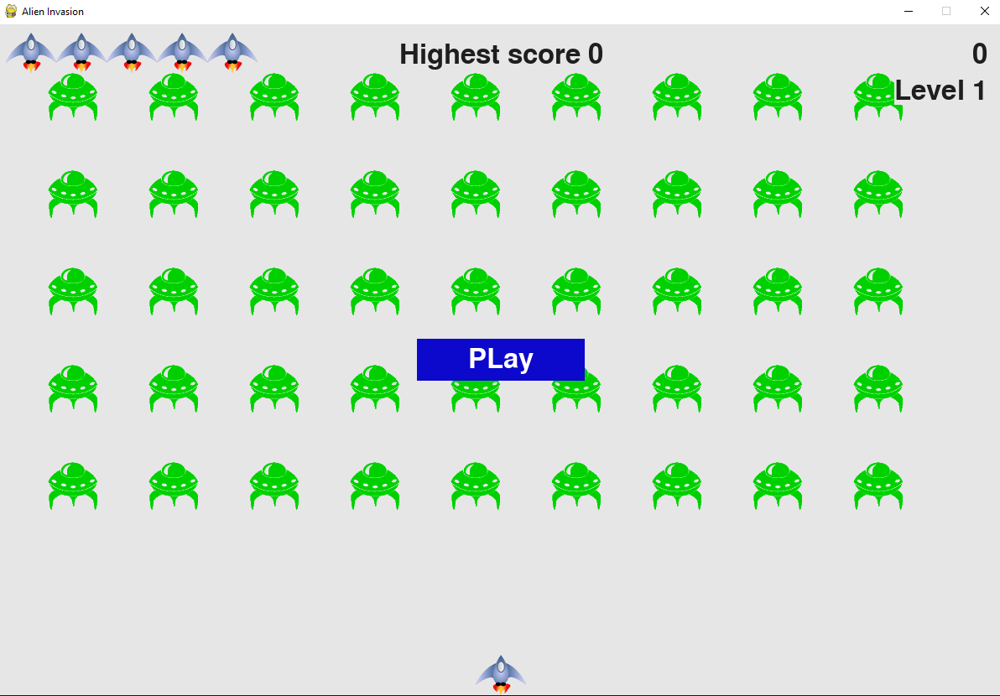
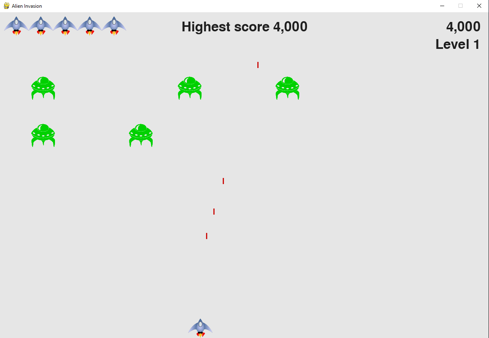

# Alien Invasion

## Table of contents

- [Overview](#overview)
- [Features](#features)
- [Installation and requirements](#installation-and-requirements)
- [How to Play](#how-to-play)
- [Screenshots](#screenshots)
- [Technologies](#technologies)

## Overview

This project is a Python implementation of the classic arcade game **Space Invaders**. In this game, the player controls a spaceship and must defend the Earth by shooting down waves of incoming alien invaders. The game is designed to be simple yet fun, offering a nostalgic experience reminiscent of the original 1978 game.

## Features

- **Player Control:** Move the spaceship left and right using the arrow keys and shoot with the spacebar.
- **Enemy Waves:** Aliens move across the screen, descending gradually as they reach the screen edges.
- **Scoring System:** Earn points by destroying aliens. The game keeps track of your score during each session.
- **Multiple Levels:** Survive waves of aliens that become progressively faster and more challenging.
- **Game Over:** The game ends when an alien reaches the bottom of the screen or when the player is hit by an alien bullet.

## Installation and requirements

To run the Space Invaders clone, you need to have the following installed:

- **Python 3**
- **Pygame**

You can install Pygame using pip:

```bash
pip install pygame
```

## How to Play

1. **Clone the Repository**
   Clone this repository to your local machine using:

   ```bash
   git clone https://github.com/sebkli/alien-invasion.git
   ```

2. **Navigate to the Project Directory**
   Change your working directory to the project's root folder:

   ```bash
   cd alien-invasion
   ```

3. **Run the Game**
   Launch the game by running the following command:

   ```bash
   python alien_invasion.py
   ```

4. **Controls**

   - **Arrow Keys:** Move the spaceship left or right.
   - **Spacebar:** Shoot bullets at the aliens.
   - **Q:** Exit the game.

5. **Objective**
   Destroy all the aliens before they reach the bottom of the screen. The game will get progressively harder with each wave of enemies.

## Screenshots

<br>
<br>

## Technologies

- Python 3
- Pygame
